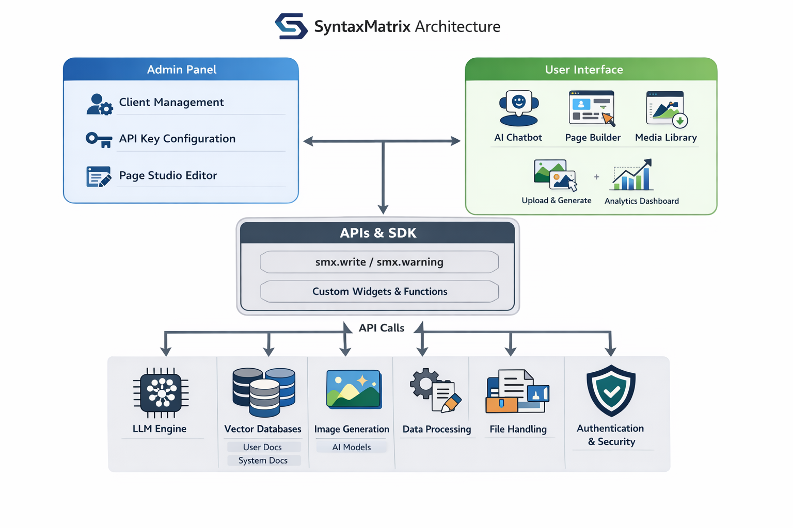
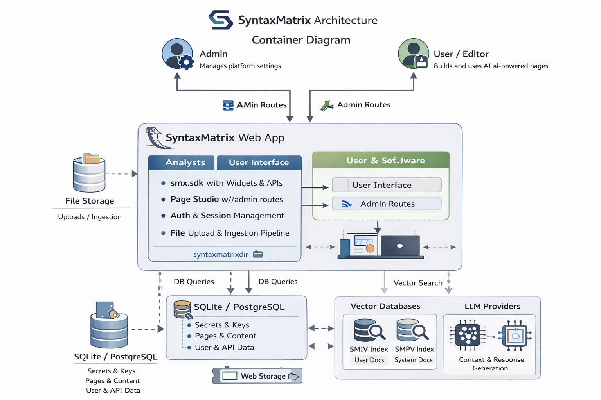
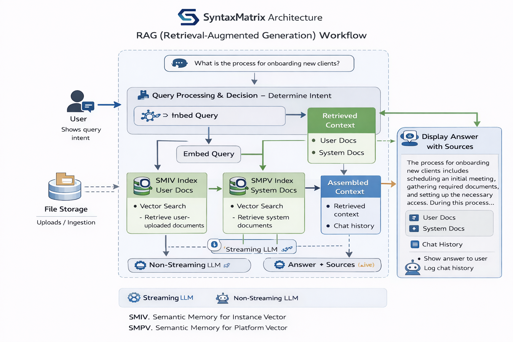
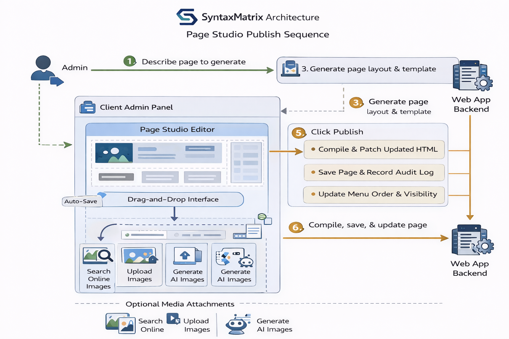
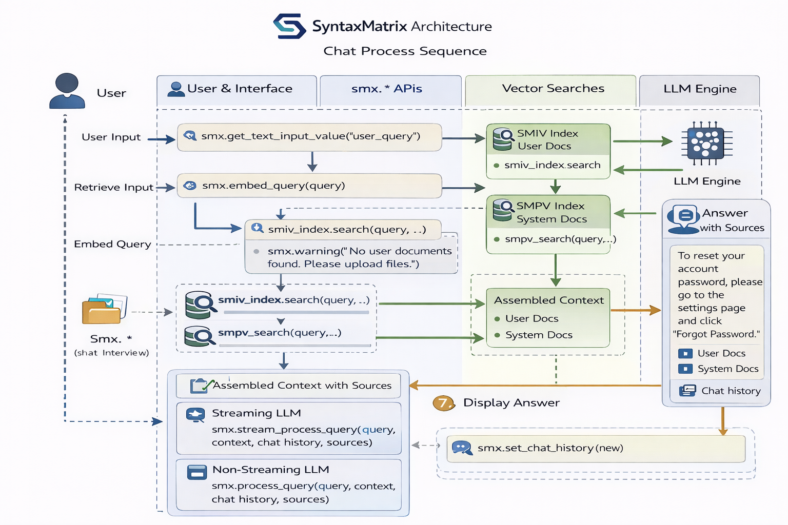
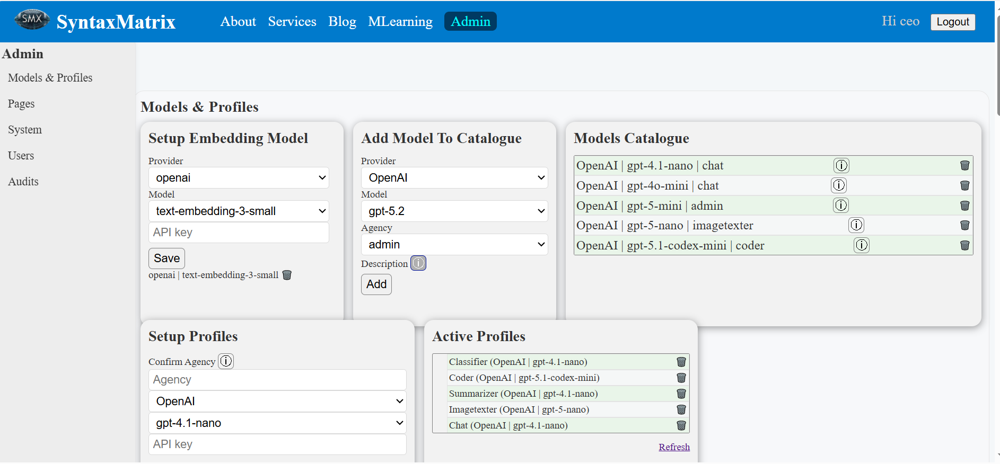
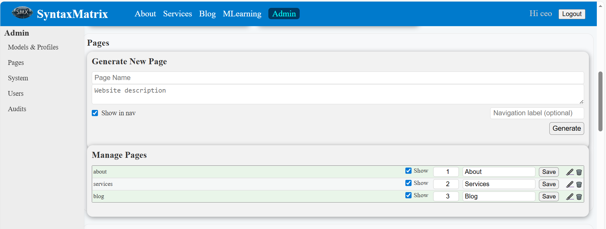
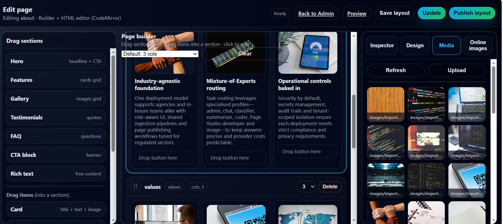
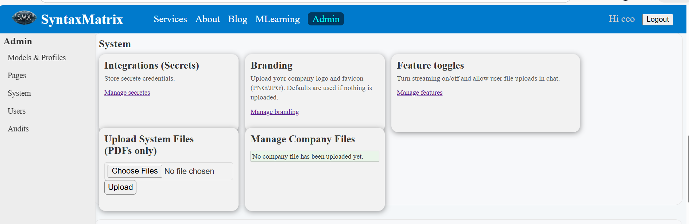

# SyntaxMatrix — Client Instance System Documentation

> **Purpose:** This README is the **system documentation** for a client instance built on the **SyntaxMatrix Framework**.  
> If you are a developer integrating SyntaxMatrix into your own product, this document explains what it is, what it does, how it is structured, how to run it, and how to use the core `smx.*` APIs from your client app.

---

## Table of contents

- [What SyntaxMatrix is](#what-syntaxmatrix-is)
- [Who it is for](#who-it-is-for)
- [Why businesses choose it](#why-businesses-choose-it)
- [Core capabilities](#core-capabilities)
- [Page Studio](#page-studio)
  - [Generation, editing, and publishing](#generation-editing-and-publishing)
  - [Menu display, visibility, and sorting](#menu-display-visibility-and-sorting)
  - [Vibe coding workflow](#vibe-coding-workflow)
  - [Media workflow: search, upload, generate](#media-workflow-search-upload-generate)
  - [Hidden pages and “Read more” buttons](#hidden-pages-and-read-more-buttons)
- [Key concepts](#key-concepts)
- [Architecture](#architecture)
- [Install and run](#install-and-run)
- [Secrets and API keys](#secrets-and-api-keys)
- [Client-app development](#client-app-development)
  - [Starter `app.py` (copy‑paste)](#starter-apppy-copypaste)
  - [Client API reference (what you will call)](#client-api-reference-what-you-will-call)
  - [Common patterns](#common-patterns)
- [Admin Panel guide](#admin-panel-guide)
- [Deployment](#deployment)
- [Screenshots and tutorial placeholders](#screenshots-and-tutorial-placeholders)
- [Troubleshooting](#troubleshooting)
- [Support and extensions](#support-and-extensions)
---

## What SyntaxMatrix is

**SyntaxMatrix** is a full‑stack Python framework that helps development teams **provision AI platforms for clients quickly**, without sacrificing control, privacy, or maintainability.

A typical SyntaxMatrix client instance includes:

- A **web application** (Flask-based) with authentication and role-based access
- An **Admin Panel** for:
  - managing pages (create, edit, publish)
  - uploading and ingesting company documents
  - controlling UI themes/modes
  - managing audit logs and content updates
- A built-in **AI Assistant** that supports:
  - standard chat
  - **streaming** responses
  - Retrieval Augmented Generation (RAG) with *two* vector stores:
    - **SMIV**: SyntaxMatrix In‑session Vectorstore (per user/session) memory for user uploads
    - **SMPV**: SyntaxMatrix Persistent Vectorstore for system/company documentation
- A **Dashboard / ML Lab** Machine Learning Lab (optional module) for CSV upload, EDA, and safe, code-generated modelling workflows

In short: SyntaxMatrix is the “platform builder” behind many client‑branded AI applications.

---

## Who it is for

### Primary audience
- **Software / AI engineering teams** building internal or customer-facing AI platforms
- **Businesses** who want to own and control their AI platform rather than being locked into a single vendor SaaS
- **Consultancies / agencies** delivering AI enabled portals for multiple clients

### Common use cases
- Company knowledge assistant (policies, manuals, SOPs, product docs)
- Customer support assistant with organisation approved knowledge
- Internal operational assistant (HR, onboarding, IT support, compliance)
- Education/tutoring portals with private content ingestion
- Data analytics dashboards enhanced by an assistant

---

## Why businesses choose it

- **Ownership & privacy:** client data stays inside the client instance (including system documents and configuration).
- **Fast provisioning:** page builder + templates + admin workflows speed up delivery.
- **Page Studio:** generate pages, edit with drag‑and‑drop sections, and control navigation (show/hide/sort) entirely inside the client’s instance.
- **Two-layer RAG:** keep **system/company** knowledge separate from **user uploads** by default.
- **Role-based security:** admin features are gated behind roles.
- **Flexible deployment:** run locally, on a VM, behind Gunicorn, Docker, or cloud platforms.
- **Extensible:** add pages, tools, vector DB adapters, and providers as your needs grow.
- **Operational clarity:** audit logs and admin workflows reduce “mystery changes” in production.

---

## Core capabilities

### 1) Page provisioning (Admin Panel)
- Generate a page from the Admin Panel
- Redirect into an **edit page** workflow
- Drag-and-drop page sections inside a canvas
- Publish updated pages to the site (stored as templates/content)

### 2) Document ingestion
- Upload PDFs in the Admin Panel
- Chunk, embed, and index into the **persistent system store (SMPV)**
- Use these documents as “approved company knowledge” at query time

### 3) User uploads (per session)
- Users can upload documents during a session
- These are indexed into **SMIV** (in-memory, session-scoped)
- They can be used as “personal context” without contaminating system data

### 4) Streaming chat (optional, per client app)
- Stream tokens/partials to the UI for better UX
- Fall back to non-streaming mode when needed

---

## Page Studio

The **Page Studio** is the part of SyntaxMatrix that turns the platform into a *site builder + AI assistant* inside the client’s own instance.  
It is designed so non‑technical teams can create and maintain high‑quality pages, while developers keep full control of governance, branding, and deployment.

Page Studio combines:

- **AI-assisted page generation** (from a short description or business goal)
- **A visual editor** for page content and layout
- **Drag-and-drop sections** (hero, features, FAQs, testimonials, pricing, CTAs, and more)
- **Menu controls** (visibility toggles, ordering/sorting, and navigation behaviour)
- **Built-in media workflows** (search, upload, and AI image generation)

This is a major architectural requirement for businesses who want an AI platform that can evolve quickly without waiting for a full development sprint.

### Generation, editing, and publishing

Typical workflow:

1. An admin creates a new page in the Admin Panel (Page Studio).
2. SyntaxMatrix generates:
   - a page layout (sections + structure)
   - initial copy for headers, paragraphs, and CTAs
   - optional hero content and call-to-action buttons
3. The admin is redirected to the editor to refine the page:
   - update copy
   - reorder sections
   - add new sections via drag‑and‑drop
4. Publish the page to make it live.

Under the hood, the editor updates a layout model that is compiled/patched into the page template so the published page stays consistent and maintainable.

### Menu display, visibility, and sorting

Page Studio includes navigation controls so admins can manage what appears in the live site:

- **Show/hide pages** from the main navigation
- **Sort pages** to control menu order (top-to-bottom)
- **Toggle visibility without deleting content**, which is useful for:
  - seasonal campaigns
  - staged rollouts
  - internal-only pages
  - “coming soon” content

### Vibe coding workflow

SyntaxMatrix supports a *vibe coding* approach for page building:

- You describe what you want (a new page, a new section, a different tone, a new CTA).
- The system generates a strong first draft.
- You iterate quickly in the editor with drag‑and‑drop sections and content changes.
- You publish and improve continuously.

It feels like building with a creative assistant, but the output stays inside the client’s own platform and governance rules.

### Media workflow: search, upload, generate

Page Studio makes media practical for teams:

- **Search for images online within the platform** (so teams do not need to jump between tools)
- **Upload your own custom images** (brand assets, event photos, product shots)
- **Generate images with the assistant** when a suitable asset does not already exist

This means marketing and operations teams can ship pages that look polished without external tooling, while keeping the instance self-contained.

### Hidden pages and “Read more” buttons

A powerful pattern is:

- Create “deep content” pages (guides, case studies, documentation, FAQs)
- Keep them **hidden from the main navigation**
- Add buttons/links on visible pages that point to them, such as:
  - “Read more”
  - “Learn more”
  - “See full guide”

This lets teams build structured content journeys:
- short landing page → deeper explanation → contact/CTA  
…without cluttering the main menu.

---


## Key concepts

### Client instance
A **client instance** is a deployable app that imports and uses the `syntaxmatrix` package.  
It contains your branding, custom pages, and any business-specific logic.

### Workspace directory (`syntaxmatrixdir/`)
SyntaxMatrix stores runtime data such as:
- SQLite databases
- uploaded files
- generated templates/pages
- vector indices / metadata

> The exact location can vary by project configuration, but the intent is always the same: keep the client’s operational data in a predictable, portable workspace folder.

### Vector stores: SMIV vs SMPV
- **SMIV** (“SyntaxMatrix In‑memory Vectorstore”): session scoped
  - best for: *user uploads*, ephemeral context, personal documents
- **SMPV** (“SyntaxMatrix Persistent Vectorstore”): long-lived
  - best for: *company/system docs*, approved knowledge base

### Intents
Client apps often support intent routing such as:
- `none` — do not retrieve any docs
- `user_docs` — retrieve from SMIV only
- `system_docs` — retrieve from SMPV only
- `hybrid` — retrieve from both

---

## Architecture

**High-level flow**

1. Admin ingests company docs → chunk/embed → index into **SMPV**
2. User uploads docs in session → chunk/embed → index into **SMIV**
3. Client app receives query → optional retrieval based on intent
4. Assistant composes final prompt with:
   - chat history
   - retrieved context
   - system rules
5. Model responds (streaming or not)
6. UI updates state (chat history, widgets)

**Architecture Diagrams**





**RAG Worflow**


**Page Sequence diagram**


**Chat Sequence diagram**


**Cleit Data Models diagram**


---

## Install and run

### Prerequisites
- Python **3.10+** (recommended)
- `pip` and `venv`

### 1) Create and activate a virtual environment

```bash
# If you want a virvual environment named ".venv"
python -m venv .venv
# Windows - activate your virtual environment
.venv\Scripts\activate
# macOS/Linux - activate your virtual environment
source .venv/bin/activate
```

### 2) Install the SyntaxMatrix Framework
The SyntaxMatrix installation includes all the requirements you need.

```bash
pip install syntaxmatrix
```
Install `requirements.txt`:

```bash
pip freeze > requirements.txt
```

### 3) Run the client instance

```bash
python app.py
```

### 4) First run checklist (Admin setup)
1. Open the app in your browser. NB: At first launch, your instance of SyntaxMatrix will add the "syntaxmatrixdir" folder 
   with all its content to the client project. Inside this folder you will find the "superadmin_credentials.txt" file.
   Use the provide credentials to login as the CEO. You now have access to the admin panel which appears on the navbar.
2. Sign in with the provided credentials into your superadmin account.
3. In the Admin Panel:
   - create a user and give it "admin" previlege. 
     Use this admin for most operations on your system. 
     You can create other accounts for your staff and give different access levels. 
     All accounts, except the superadmin have limited access.
     Only the "superadmin" and "admin" have access to the admin panel and can add/edit items
     Only the "superadmin" can remove/delete items of the admin panel.
   - configure models (LLM/Embedding) and create your team of experts (mix and match providers) per your needs
   - store / remove API keys/secrets (see next section)
   - upload system/company docs for SMPV
   - generate and publish initial pages

---

## Secrets and API keys

**Important:** In this client instance, **secrets and keys are not stored in a `.env` file**.

Instead:
- keys are collected in the **Admin Panel UI**
- saved into the instance database
- loaded by the framework at runtime

This model is useful for:
- teams managing multiple client instances
- avoiding accidental secret commits
- supporting admin managed rotations without redeploying code

**Operational guidance**
- restrict Admin Panel access (roles + network controls)
- back up the workspace database securely
- rotate keys using the Admin Panel workflow

---

## Client-app development

### Starter `app.py` (copy‑paste)

```python
import syntaxmatrix as smx


def create_conversation(streaming):

    chat_history = smx.get_chat_history() or []
    sid = smx.get_session_id()
    smiv_index = smx.smiv_index(sid)

    try:
        query, intent = smx.get_text_input_value("user_query")
        if query == "":
            return
        
        query = query.strip()
        chat_history.append(("User", query))
        sources = []

        if intent == "none":   
            context = ""  
        else:   
            q_vec = smx.embed_query(query)
            if q_vec is None:
                return
            
            results = []
            if intent in ["hybrid", "user_docs"]:
                user_hits = smiv_index.search(q_vec, top_k=3)
                if not user_hits:
                    if smx.enable_user_files():
                        smx.error("""
                            Please upload the pdf to discuss about. Click the + button or contact support.
                        """)
                    return
                results.append("\n### Personal Context (user uploads)\n")
                for hit in user_hits:
                    text = hit["metadata"]["chunk_text"].strip().replace("\n", " ")
                    results.append(f"- {text}\n")
                sources.append("User Docs")

            if intent in ["hybrid", "system_docs"]:
                sys_hits = smx.smpv_search(q_vec, top_k=5)
                if not sys_hits:
                    smx.error("Please contact support.")
                    return
                results.append("### System Context (company docs)\n")
                for hit in sys_hits:
                    text = hit["chunk_text"].strip().replace("\n", " ")
                    results.append(f"- {text}\n")
                sources.append("System Docs")

            context = "".join(results)
        
        conversations = "\n".join([f"{role}: {msg}" for role, msg in chat_history])
        
        if streaming:
            smx.stream_process_query(query, context, conversations, sources)      

        else:
            answer = smx.process_query(query, context, conversations)
        
            if isinstance(answer, str) and answer.strip():
                if sources:
                    src_list = "".join(f"<li>{s}</li>" for s in sources)
                    answer += f"<ul style='margin-top:5px;color:blue;font-size:0.8rem;'>{src_list}</ul>"
                chat_history.append(("Bot", answer))
        
        smx.set_chat_history(chat_history)
        smx.clear_text_input_value("user_query")

    except Exception as e:
        smx.error(f"UI:- {type(e).__name__}: {e}")

# Activate System Widgets (predefined)
smx.text_input(key="user_query", id="user_query", label="Enter query", placeholder="Ask me anything ...")
smx.button(key="submit_query", id="submit_query", label="Submit", callback=lambda: create_conversation(smx.stream()))
smx.file_uploader("user_files", id="user_files", label="Upload PDF files:", accept_multiple_files=True)

# Register Custom Widgets
def clear_chat():
    smx.clear_chat_history()

# Call custom widget 'clear_chat' function
smx.button("clear_chat", "clear_chat", "Clear", clear_chat)


app = smx.app
if __name__ == "__main__":
    smx.run()
```

---

### Client API reference (what you will call)

Below is the **practical client-surface API** used in typical SyntaxMatrix apps (including the starter above).  
Your exact instance may expose additional helpers, but these are the core building blocks.

#### App lifecycle
- `smx.app`
  - The underlying Flask app instance
- `smx.run(...)`
  - Starts the server (development-friendly runner).

#### Session + state
- `smx.get_session_id() -> str`
  - Returns the current session identifier.
- `smx.get_chat_history() -> list[tuple[str, str]] | None`
  - Returns chat history for the current session/user.
- `smx.set_chat_history(history: list[tuple[str, str]]) -> None`
  - Persists the updated chat history.
- `smx.clear_chat_history() -> None`
  - Clears chat history (useful for “Reset” buttons).

#### Widgets (UI inputs/controls)
- `smx.text_input(key, id, label, placeholder=...)`
  - Registers a text input widget.
- `smx.button(key, id, label, callback=...)`
  - Registers a button widget and binds it to a Python callback.
- `smx.file_uploader(key, id, label, accept_multiple_files=True)`
  - Allows users to upload files (often PDFs) into SMIV.
- `smx.get_text_input_value(key_or_id) -> tuple[str, str] | str`
  - Reads user input. In many client apps, this can return both `query` and an `intent`.
- `smx.clear_text_input_value(key_or_id) -> None`
  - Clears an input widget’s value.

#### UX messages and rendering
- `smx.write(content: str) -> None`
  - Writes content to the UI (plain text or HTML depending on your UI mode).
- `smx.warning(message: str) -> None`
  - Shows a warning banner/toast/inline message - orange colour.
- `smx.error(message: str) -> None`
  - Shows an error banner/toast/inline message - red colour.

> Tip: Keep user-facing errors actionable (what to do next), and keep internal tracebacks in server logs.

#### RAG and retrieval
- `smx.embed_query(text: str) -> list[float] | None`
  - Creates an embedding vector using the configured embeddings provider.
- `smx.smiv_index(session_id: str)`
  - Returns a session-scoped vector index object.  
  - Common method: `index.search(vector, top_k=...) -> list[dict]`
- `smx.smpv_search(vector, top_k: int = 5) -> list[dict]`
  - Searches persistent system/company documentation.

#### LLM execution
- `smx.process_query(query: str, context: str, conversations: str) -> str`
  - Returns a complete (non-streaming) answer as a string.
- `smx.stream_process_query(query: str, context: str, conversations: str, sources: list[str] | None = None) -> None`
  - Streams the response to the UI.

#### Streaming mode flag
- `smx.stream() -> bool`
  - Returns whether streaming is enabled (often controlled via a UI toggle).

---

### Common patterns

#### 1) Intent routing
Use a small set of intents to keep retrieval predictable and controllable:

- `none`: no retrieval, pure chat
- `system_docs`: query the approved company knowledge base
- `user_docs`: query the user’s uploaded documents
- `hybrid`: both

#### 2) Keep system docs and user docs separate
A common safety and quality pattern is:

- **System docs** (SMPV): trusted, approved content
- **User docs** (SMIV): personalised, session‑scoped content

This reduces accidental “cross-contamination” of knowledge sources.

#### 3) Stream by default (optional)
For a modern UX, most teams enable streaming by default and allow users to turn it off when needed.

---

## Admin Panel guide

> **Note:** Routes and labels can vary per client instance, but the workflow is consistent.


### Page Studio (site builder inside your instance)

Page Studio is where admins and content owners manage the **website side** of the platform:

- **Generate pages** from a short brief (AI creates a structured first draft)
- **Edit content visually** with drag‑and‑drop sections
- **Manage navigation**: show/hide pages, change ordering, and control what users see
- **Maintain brand consistency**: headers, buttons, hero styles, and spacing follow the instance theme
- **Work with media** directly in-platform: search, upload, and AI image generation

Because these capabilities live inside the client instance, teams can keep improving their site and assistant experience without depending on external builders or vendor tools.

### Page provisioning workflow
1. Create a page in the Admin Panel (often by describing the page purpose).
2. The system generates the page and redirects you into an edit workflow.
3. In the page editor:
   - adjust text, layout, hero sections
   - drag-and-drop new sections
4. Publish the page to make it live.

### System docs ingestion (SMPV)
1. Open the ingestion/upload area in the Admin Panel.
2. Upload company documents (PDFs and other supported formats).
3. The framework:
   - extracts content
   - chunks it
   - embeds it
   - stores it into the persistent store
4. Your assistant can now retrieve this knowledge.

### Themes and UI modes
Admins can typically:
- set the colour palette
- set light/dark UI mode
- control favicon/icon overrides
- tune the homepage and navigation

---

## Deployment

### Development
- Run `python app.py` (or `smx.run()`) locally.
- Use a `.venv` and pinned requirements.

### Production (typical)
- **Gunicorn**:
  ```bash
  gunicorn app:app --workers 2 --bind 0.0.0.0:8000
  ```
- **Docker**:
  - Build an image for the client instance.
  - Mount the workspace directory as a persistent volume.
- **Cloud Run / VM**:
  - Keep the workspace directory persistent.
  - Apply network controls around the Admin Panel.

> If you run multiple client instances, ensure each instance has its own isolated workspace directory and database.

---

## Screenshots and tutorials

### Screenshots

#### Model Profiles
- Admin Panel overview  
    


- Page generation / visibility + ordering 
    

- Edit page canvas / drag-and-drop / media (search/upload/generate) 
    


- Document ingestion / branding configurations
    
  

### Tutorial videos (placeholders)

- Getting started (Admin + first page)  
  - Video: `https://youtube.com/watch?v=PtGH1kaWm9M`


- Page Studio deep dive (sections, menu controls, “Read more”, and media)  
  <!-- TODO: add video link -->
  - Video: `https://www.youtube.com/watch?v=PtGH1kaWm9M`

- Uploading system docs + verifying retrieval  
  <!-- TODO: add video link -->
  - Video: `https://...`

- Building a custom client `app.py` workflow  
  <!-- TODO: add video link -->
  - Video: `https://...`

---

## Troubleshooting

### “No system documents found” / retrieval returns empty
- Confirm system documents were uploaded and indexed in the Admin Panel.
- Confirm embeddings/provider configuration is set.
- Confirm your query intent is `system_docs` or `hybrid`.

### Streaming not working
- Verify your UI has streaming enabled (toggle or default).
- Confirm your callback calls `smx.stream_process_query(...)`.

### Errors during publish after adding sections
- This normally indicates the HTML cannot be safely patched from the generated layout.  
  If you are seeing messages like **“html not compatible with patching”**, capture:
  - the generated layout JSON (before publish)
  - the current HTML/template being patched
  - the exact section you added
  Then apply a minimal patch to the HTML patching layer (keep changes small and test existing pages).

---

## Support and extensions

### Extending your client instance
Common extension points:
- custom pages and templates
- new admin workflows (per industry)
- custom retrieval tools and filters
- custom vector database adapters
- custom model/provider selection policies
- optional fine-tuning service (organisation-specific models), if enabled for your deployment

### Getting help
- Raise an issue in your internal tracker with:
  - steps to reproduce
  - logs
  - the relevant template/page slug
  - a screenshot or short video

---

